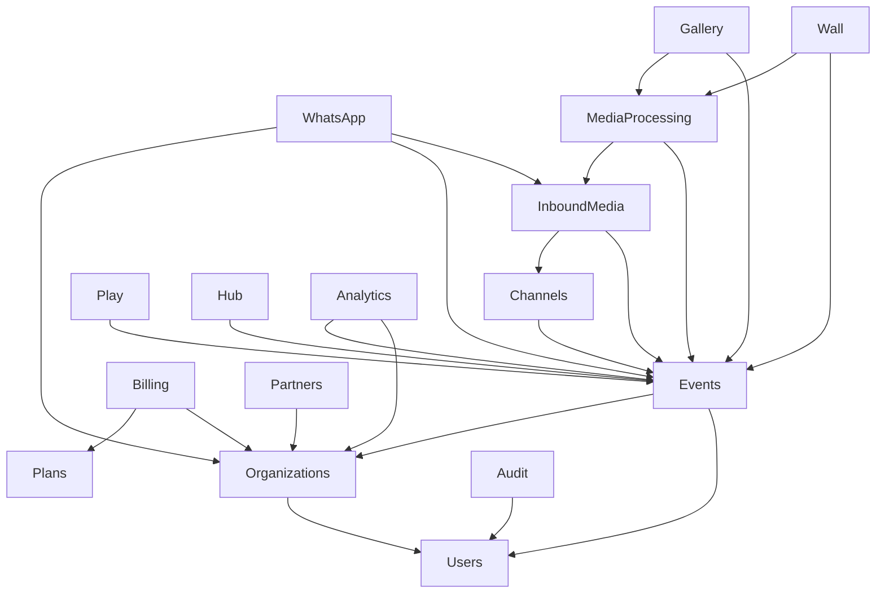

# Mapa de Módulos — Evento Vivo

## Visão Geral

| # | Módulo | Camada | Etapa | Descrição |
|---|--------|--------|-------|-----------| 
| 1 | Organizations | Core | 1 | Contas/organizações parceiras |
| 2 | Users | Core | 1 | Usuários do sistema |
| 3 | Roles | Core | 1 | Perfis e permissões |
| 4 | Auth | Core | 1 | Autenticação e tokens |
| 5 | Events | Core | 1 | Eventos — entidade principal |
| 6 | Channels | Ingestão | 2 | Canais de entrada (WhatsApp, link, etc.) |
| 7 | InboundMedia | Ingestão | 2 | Recepção e normalização de webhooks |
| 8 | **WhatsApp** | **Ingestão / Messaging** | **2** | **Core WhatsApp: instâncias, envio, inbound, automação** |
| 9 | MediaProcessing | Processamento | 2 | Download, variantes, moderação, publicação |
| 10 | Gallery | Experiência | 3 | Galeria ao vivo e curadoria |
| 11 | Wall | Experiência | 3 | Telão/slideshow realtime |
| 12 | Play | Experiência | 4 | Jogos interativos (memória, puzzle) |
| 13 | Hub | Experiência | 4 | Página central do evento |
| 14 | Plans | Negócio | 5 | Catálogo de planos |
| 15 | Billing | Negócio | 5 | Assinaturas e cobranças |
| 16 | Partners | Negócio | 5 | Camada B2B para parceiros |
| 17 | Analytics | Suporte | 5 | Métricas e consolidados |
| 18 | Audit | Suporte | 5 | Trilha de auditoria |
| 19 | Notifications | Suporte | 5 | Avisos e alertas |

## Dependências entre Módulos



## Fluxo Principal de Mídia

```
Webhook → InboundMedia → MediaProcessing → Gallery/Wall
           (webhooks)     (media-download)   (media-publish)
                          (media-process)
```

## Fluxo WhatsApp

```
Z-API Webhook → WhatsApp Module → [Se mídia+evento] → InboundMedia → MediaProcessing → Gallery
                     ↓
              [Se texto/sistema] → Persiste internamente
                     ↓
              [Se grupo vinculado] → Auto-reaction / Auto-reply
```

## Fluxo de Envio WhatsApp

```
Frontend → API → WhatsAppMessagingService → SendWhatsAppMessageJob → ProviderAdapter → Z-API
                         ↓                          ↓
                 whatsapp_messages              dispatch_log
                 (status: queued)             (audit trail)
```
