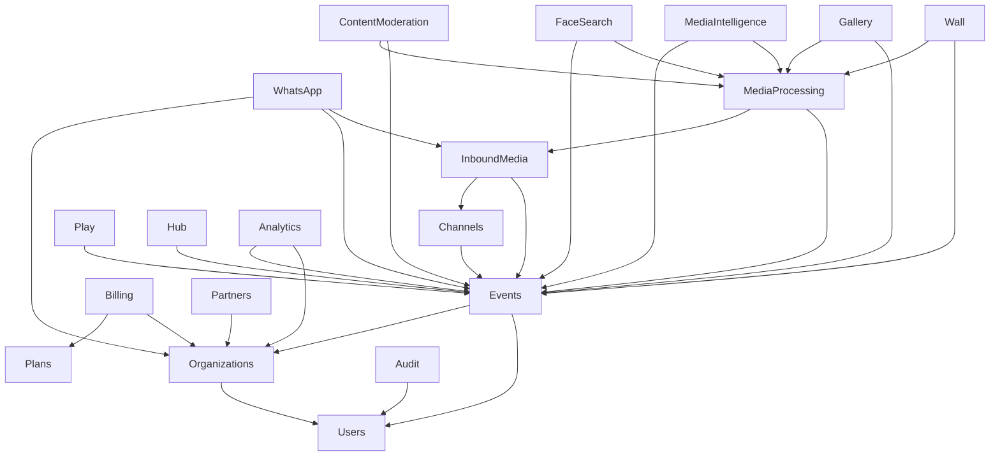

# Mapa de Modulos - Evento Vivo

## Visao Geral

| # | Modulo | Camada | Etapa | Descricao |
|---|--------|--------|-------|-----------|
| 1 | Organizations | Core | 1 | Contas e organizacoes parceiras |
| 2 | Users | Core | 1 | Usuarios do sistema |
| 3 | Roles | Core | 1 | Perfis e permissoes |
| 4 | Auth | Core | 1 | Autenticacao e tokens |
| 5 | Events | Core | 1 | Eventos como entidade principal |
| 6 | Channels | Ingestao | 2 | Canais de entrada como WhatsApp e link |
| 7 | InboundMedia | Ingestao | 2 | Recepcao e normalizacao de webhooks |
| 8 | WhatsApp | Ingestao / Messaging | 2 | Core WhatsApp: instancias, envio, inbound e automacao |
| 9 | MediaProcessing | Processamento | 2 | Download, variantes, moderacao e publicacao |
| 10 | ContentModeration | Processamento | 2 | Safety moderation e avaliacoes de risco por foto |
| 11 | FaceSearch | Processamento | 2 | Configuracao, indexacao facial por evento e base vetorial inicial |
| 12 | MediaIntelligence | Processamento | 2 | VLM rapido, prompts por evento e historico semantico por foto |
| 13 | Gallery | Experiencia | 3 | Galeria ao vivo e curadoria |
| 14 | Wall | Experiencia | 3 | Telao e slideshow realtime |
| 15 | Play | Experiencia | 4 | Jogos interativos |
| 16 | Hub | Experiencia | 4 | Pagina central do evento |
| 17 | Plans | Negocio | 5 | Catalogo de planos |
| 18 | Billing | Negocio | 5 | Assinaturas e cobrancas |
| 19 | Partners | Negocio | 5 | Camada B2B para parceiros |
| 20 | Analytics | Suporte | 5 | Metricas e consolidados |
| 21 | Audit | Suporte | 5 | Trilha de auditoria |
| 22 | Notifications | Suporte | 5 | Avisos e alertas |

## Dependencias entre Modulos



## Fluxo Principal de Midia

```text
Webhook -> InboundMedia -> MediaProcessing -> Gallery/Wall
           (webhooks)     (media-download)   (media-publish)
                          (media-process)
                          (media-safety)
```

## Fluxo WhatsApp

```text
Z-API Webhook -> WhatsApp Module -> [Se midia+evento] -> InboundMedia -> MediaProcessing -> Gallery
                     |
                     +-> [Se texto/sistema] -> Persiste internamente
                     |
                     +-> [Se grupo vinculado] -> Auto-reaction / Auto-reply
```

## Fluxo de Envio WhatsApp

```text
Frontend -> API -> WhatsAppMessagingService -> SendWhatsAppMessageJob -> ProviderAdapter -> Z-API
                         |                          |
                         +-> whatsapp_messages      +-> dispatch_log
                             (status: queued)          (audit trail)
```
